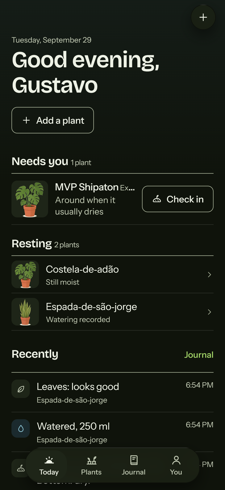
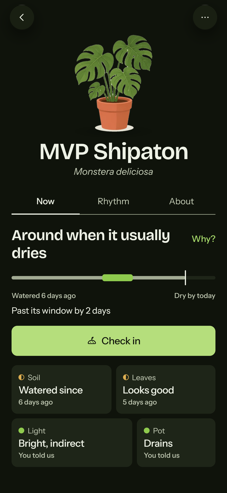
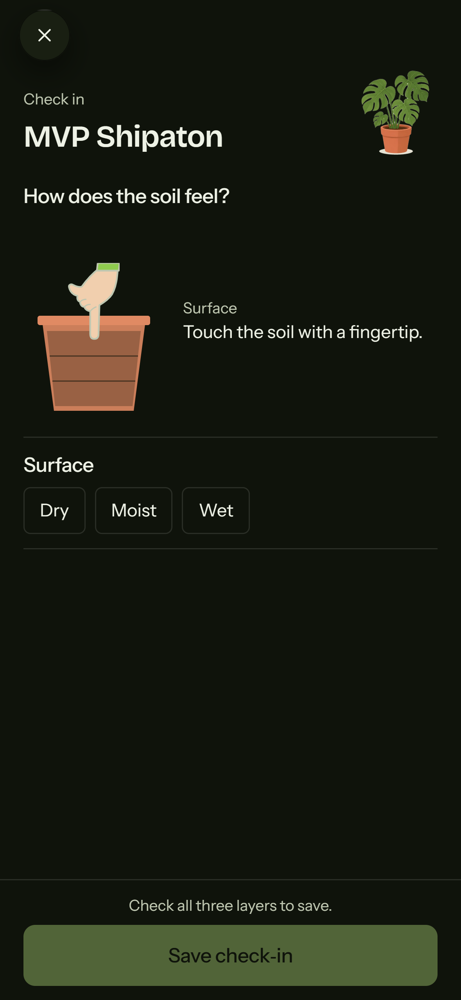
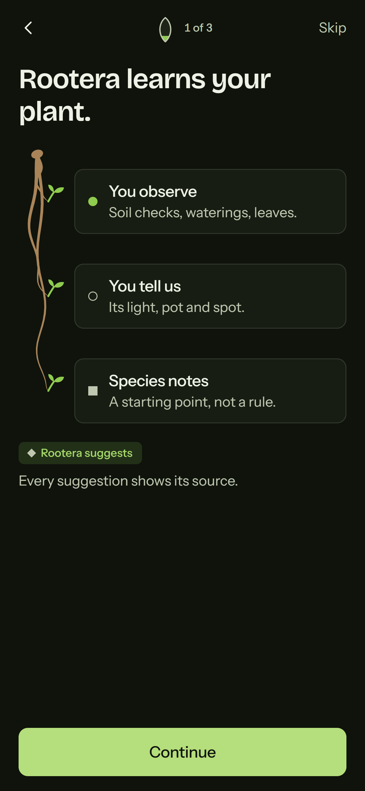
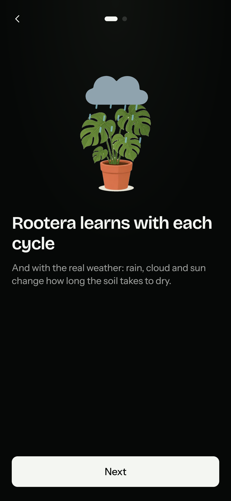
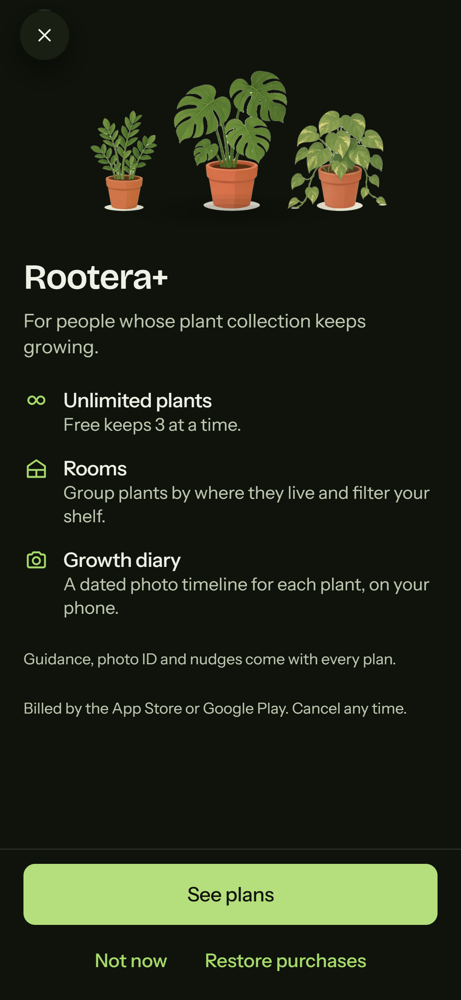

# Rootera

**Your plant changes. Rootera learns the pattern.**

Rootera is a plant-care app that learns *one specific plant*: where it lives, the pot it is in, and how its soil actually dries, instead of pushing a watering calendar. Built for the [RevenueCat Shipaton 2026](https://www.shipaton.com/) (Next Gen Award) with Expo (React Native + TypeScript) and a FastAPI backend.

[Português](README.pt-BR.md) · Try it in the browser: [rootera.byguto.com](https://rootera.byguto.com) · Demo video: [YouTube](https://www.youtube.com/watch?v=mT3kwDD25DU) · Submission: [Devpost](https://devpost.com/software/rootera-5mocq7) · License: [MIT](LICENSE)

| Today | A plant's window | Three-layer check | Onboarding | Shipaton lab | Rootera+ |
|---|---|---|---|---|---|
|  |  |  |  |  |  |

## The problem

University extension guides agree on one rule for houseplants: water when the soil says so, not when the calendar does. The trouble is that "check the soil" is vague. How deep? What if the top is dry and the bottom is soaked? And how long does *this* plant, in *this* pot, in *this* weather, usually take to dry? Rootera turns that rule into something a beginner can follow, and learns the answer for each plant.

## What it does

- **Three-layer soil check.** Surface (fingertip), middle (a finger, about 5 cm) and bottom (a wooden skewer or the drainage hole): each dry, moist or wet, and the bottom can be "couldn't reach". Each of the 16 species decides at its own depth: a peace lily at the surface, a monstera around the middle, a succulent only when the whole pot is dry. The layers catch things one reading can't: *dry on top but wet at the bottom* means wait; *the bottom is still dry after a watering* means the water never reached it.
- **A drying window per plant.** A cycle runs from a watering to the first dry check. Before any cycle, Rootera starts from a species estimate adjusted for the pot (size, material, drainage, light). It says *"still analyzing your plant"* at first, gets specific from the second cycle, and from the third the window comes from the plant's own records.
- **Local weather.** With permission, the approximate location (rounded to about 10 km) fetches the last 92 days and the next 3 from Open-Meteo. The evapotranspiration of the week nudges the window, by at most 0.8× to 1.25×, and less indoors than outdoors. Learned cycles are compared with the weather they actually had, so the weather is never counted twice.
- **Every suggestion shows its source.** What you observed, what you told us, species notes, the weather. A report like "dry" is never turned into a made-up percentage.
- **Photo identification** (Pl@ntNet, on the server): up to three tries, then the app asks for the name. The photo only suggests a species; you confirm it, and the plant keeps its illustration.
- **Nudges on the phone** at the time you choose, only on days a plant is due, and a tap opens that plant's check.
- **Shipaton lab.** A virtual plant for judges and testers: a short animated story, then up to 91 days with a watering method of your choice, in real recorded climates (São Paulo spring, Porto Alegre winter). Tap a day to water it or to record the soil and leaves, and watch Rootera learn.
- **Rootera+ through RevenueCat.** Free keeps three plants; Rootera+ removes the limit and adds rooms and a dated growth diary.
- Portuguese and English, light and dark, Reduce Motion everywhere, and large text layouts.

## How RevenueCat is used

| Piece | Where |
|---|---|
| Entitlement `rootera`, products `monthly`, `quarterly`, `yearly` in the current offering (`$rc_monthly`, `$rc_three_month`, `$rc_annual`) | RevenueCat dashboard |
| SDK configured with the backend's user id as the app user id | [src/billing.ts](src/billing.ts) |
| Paywall designed in RevenueCat Paywalls, shown with `presentPaywallIfNeeded({ requiredEntitlementIdentifier: 'rootera' })` | [src/billing.ts](src/billing.ts), [src/screens/Plans.tsx](src/screens/Plans.tsx) |
| Customer Center from *You → Manage subscription* | [src/billing.ts](src/billing.ts) |
| Restore purchases; a customer-info listener catches renewals and expirations | [src/billing.ts](src/billing.ts), [App.tsx](App.tsx) |
| **The server decides who is Rootera+.** After a purchase or restore the app calls `POST /v1/billing/sync`; the backend asks RevenueCat's REST API with the secret key. An optional webhook keeps it in sync. | [backend/app/integrations/revenuecat.py](backend/app/integrations/revenuecat.py), [backend/app/routes/integrations.py](backend/app/routes/integrations.py) |
| Where the native UI can't run (Expo Go, the web preview), the Plans screen shows its own picker over the same packages; with no key at all it runs a clearly labelled preview that charges nothing. | [src/screens/Plans.tsx](src/screens/Plans.tsx) |

Only public SDK keys live in the app. The secret key stays in `backend/.env`.

## Architecture

```
Expo app (React Native, TypeScript)            FastAPI backend (Python 3.12)
  screens, design system, Reanimated    HTTPS    routes → GardenService → guidance (the Plant Twin)
  react-native-purchases (+ UI)       ───────▶   SQLAlchemy: SQLite locally, PostgreSQL via DATABASE_URL
  expo-location, expo-notifications              integrations: RevenueCat REST, Pl@ntNet, Open-Meteo
          │                                      lab.py: the virtual plant simulator
          ▼
      RevenueCat
```

| Part | Files |
|---|---|
| The three layers → one reading at the species' depth | [backend/app/soil.py](backend/app/soil.py) |
| Cycles, learning phases, what to do now and why | [backend/app/guidance.py](backend/app/guidance.py) |
| The drying window: species estimate, pot factors, blending in learned cycles, weather | [backend/app/forecast.py](backend/app/forecast.py) |
| Species reference notes (16 species) | [backend/app/species.py](backend/app/species.py) |
| Open-Meteo client and weekly summary | [backend/app/integrations/weather.py](backend/app/integrations/weather.py) |
| Virtual plant for the lab, with real climates in [backend/app/data/climates.json](backend/app/data/climates.json) | [backend/app/lab.py](backend/app/lab.py) |
| App state (server is the source of truth; serialized writes with stable ids; offline cache) | [src/store.tsx](src/store.tsx) |
| Screens | [src/screens](src/screens) |
| Design system: tokens, components, motion (transforms and opacity only) | [src/ds](src/ds) |

**Why rules and not an AI model?** The inputs are few and structured (three layers, dates, pot, species, weather), and each suggestion must say where it came from. A deterministic model that adapts per plant is explainable, testable and free to run. The reasoning is in [docs/calibracao-shipaton.md](docs/calibracao-shipaton.md) (Portuguese), section 5.

## Calibration and validation

The rules were calibrated against university extension guidance:
- [SDSU Extension](https://extension.sdstate.edu/peace-lily-houseplant-how) for peace lily.
- [UConn](https://homegarden.cahnr.uconn.edu/factsheets/monstera-deliciosa) for monstera.
- [Clemson HGIC](https://hgic.clemson.edu/factsheet/how-to-grow-pothos-indoors-epipremnum-spp-care-cultivars-and-common-problems/) for pothos.
- [Virginia Tech SPES-804](https://www.pubs.ext.vt.edu/content/pubs_ext_vt_edu/en/SPES/spes-804.html) for succulents.
- [Colorado State PlantTalk 1315](https://planttalk.colostate.edu/topics/houseplants/1315-houseplants-containers/) for pot factors.

The test was a simulated caregiver following Rootera for 91 days: 16 species in 3 climates (no weather, São Paulo spring, Porto Alegre winter), using real Open-Meteo history.

| Group | No weather | São Paulo spring | Porto Alegre winter | Sources |
|---|---|---|---|---|
| Surface (peace lily, fern…) | every 6 d | 6 d | 8.8 d | about weekly; 7–12 in winter |
| Middle (monstera, pothos, rubber plant…) | 9.7 d | 9.2 d | 12.6 d | 7–14; 10–18 in winter |
| Whole pot (succulents, snake plant…) | 16.8 d | 15.4 d | 24 d | 2–3 weeks; about monthly in winter |

- **48 of 48** runs stay inside the ranges from the sources.
- The learned drying time is on average **0.52 days** from the real cycles.
- There are **zero** soggy or thirsty days.
- After a season change, the weather adjustment saves 8% of the checks.

The limits are honest: this is a simulation, not three months of physical plants. The virtual plant assumes indoor pots feel 60% of the outdoor weather.

Reproduce it from the `backend` folder with `.venv/Scripts/python tests/season_check.py`. `tests/simulate.py` compares caregiver styles.

## Run it

You need Node 20+, Python 3.12, and either Expo Go on a phone (Expo SDK 57) on the same Wi-Fi as the computer, or a browser.

```bash
git clone https://github.com/gustavo-henriq/Rootera.git
cd Rootera
npm ci
cp .env.example .env
```

Start the API in a second terminal:

```bash
cd backend
python -m venv .venv
.venv/Scripts/pip install -r requirements.txt        # macOS/Linux: .venv/bin/pip
cp .env.example .env                                  # optional keys; everything has a safe default
.venv/Scripts/python -m uvicorn app.main:app --host 127.0.0.1 --port 8000
```

Start the app from the project folder:

```bash
npx expo start --lan
```

- **Phone:** scan the QR code with Expo Go. With `EXPO_PUBLIC_API_URL=metro` (the default in `.env.example`), the dev server forwards `/rootera-api` to the API on your computer, so the phone needs only the dev server's address.
- **Browser:** press `w`, or open http://localhost:8081.
- **Web preview switches:** `?scheme=dark`, `?reduceMotion=1`, `?gallery=1` (the design system).

What works with no keys at all:
- everything except purchases and photo identification;
- the weather needs no key;
- the Plans screen runs in its labelled preview mode.

To try it:
- A fresh garden includes an example plant, "MVP Shipaton", with some history.
- The lab is under *You → Shipaton lab*.

### Optional keys

| Key | Where | What it turns on |
|---|---|---|
| `EXPO_PUBLIC_REVENUECAT_TEST_KEY` (or `_IOS_KEY` / `_ANDROID_KEY`) | `.env` | RevenueCat SDK (public key) |
| `REVENUECAT_SECRET_KEY`, `REVENUECAT_ENTITLEMENT=rootera` | `backend/.env` | Server-side entitlement check |
| `REVENUECAT_WEBHOOK_AUTH` | `backend/.env` | Webhook at `/v1/billing/webhook` |
| `PLANTNET_API_KEY` | `backend/.env` | Photo identification (limited to 30 per person per day) |

For the RevenueCat Paywall and a Test Store purchase:
- You need a development build, because in Expo Go RevenueCat runs in its Preview API mode, which mocks purchases.
- Run `npx eas build --profile development --platform android`, or `npx expo run:android` / `run:ios` with the native toolchains installed.
- The profiles are in [eas.json](eas.json).

## Tests

```bash
npm run typecheck
npm run test:model      # app helpers
npm run test:i18n       # every text has Portuguese with the same placeholders
cd backend && .venv/Scripts/python -m pytest -q
```

The backend suite (210 tests) covers:
- the rules;
- the three layers;
- the window;
- the weather;
- the lab;
- account isolation;
- hard cases found in review, such as future dates, reused ids and plant-limit bypasses;
- randomized histories.

## Privacy and keys

- Secrets only on the server (`backend/.env`, never committed); the app bundle carries public keys only.
- Location is rounded to about 10 km before it is stored, and can be turned off in *You → Local weather*.
- Photos go to Pl@ntNet only to identify the species and are not stored on the server.

## Known limits

- **Accounts.** Access is a single local preview token; per-user accounts come next.
- **Plant photos.** The growth diary lives on the phone.
- **Nudges.** They are local notifications; there is no push server.
- **Terms of use.**
  - The free Open-Meteo API is for non-commercial use.
  - Pl@ntNet's free quota (500 a day) is shared, hence the per-person limit.

## License

[MIT](LICENSE) © 2026 gustavo-henriq
