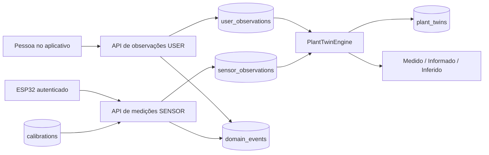

# Arquitetura do Rootera

O aplicativo usa React Native, TypeScript e Expo. O servidor usa FastAPI, classes de domínio em Python e SQLAlchemy. Os dados são persistidos em SQLite por padrão; o mesmo mapeamento relacional aceita PostgreSQL por `DATABASE_URL`.

O Plant Twin é uma representação computacional por planta, reconstruída a partir de evidências com origem e horário. A versão atual, `rules-1.0.0`, é um motor determinístico de regras. Não é um modelo de aprendizado de máquina treinado, uma previsão de saúde ou um diagnóstico botânico.

## A separação central: informado, medido e inferido

| Camada | Conteúdo | Origem | Onde é armazenada |
| --- | --- | --- | --- |
| Cadastro | Nome, espécie escolhida, cômodo, tamanho do vaso e condição de luz informada | Pessoa usuária | `plants.data` |
| Observações da pessoa | Rega, adubação, avaliação qualitativa do solo e anotações | `USER` | `user_observations` |
| Medições | ADC bruto, percentual normalizado, dispositivo, calibração, horário e qualidade | `SENSOR` | `sensor_observations` |
| Twin: `measured` | Última leitura real elegível, incluindo validade e proveniência | `SENSOR` | Projeção em `plant_twins.state` |
| Twin: `reported` | Última avaliação do solo: `dry`, `moist` ou `wet` | `USER` | Projeção em `plant_twins.state` |
| Twin: `inferred` | Estado sugerido, motivo, peso de confiança e IDs das evidências | Motor de regras | Projeção em `plant_twins.state` |

Registrar uma rega não aumenta artificialmente a umidade. Dizer “o solo está seco” não cria um percentual. A condição de luz no cadastro não é uma medição de luminosidade. Neste contrato o ESP32 envia somente a leitura do sensor de umidade do solo; não há leituras de luz, temperatura, bateria ou umidade do ar inventadas pelo servidor.

O percentual do solo representa a posição entre dois pontos de calibração do sensor. Ele não equivale, sem validação física adicional, ao teor volumétrico de água do substrato.

## Componentes e fluxo

- `backend/app/domain.py`: `Evidence`, normalização do ADC e `PlantTwinEngine`. O motor aceita um instante de avaliação explícito, permitindo repetir uma projeção para o mesmo conjunto de evidências e o mesmo instante.
- `backend/app/service.py`: `GardenService`, autorização por proprietário, gravação, idempotência, calibrações, eventos e reconstrução do Twin.
- `backend/app/db.py`: entidades relacionais, restrições de unicidade, chaves estrangeiras e configuração do banco.
- `backend/app/schemas.py`: contratos de entrada, campos permitidos, limites e validação dos horários.
- `backend/app/main.py`: rotas HTTP, autenticação por tokens, transações, CORS e criação inicial das tabelas.
- `src/api.ts`: adaptação entre o aplicativo e os contratos HTTP. Uma alteração de sensor real não é gravada como uma ação da pessoa no aplicativo.

## Persistência, eventos e reconstrução

As tabelas `profiles`, `plants`, `devices` e `calibrations` guardam os cadastros. `user_observations` e `sensor_observations` guardam evidências separadas. `domain_events` registra acontecimentos auditáveis. `plant_twins` guarda a projeção mais recente persistida por planta, sua versão de motor e o horário da avaliação.

O fluxo de escrita da evidência, do evento e do Twin usa a mesma transação. O serviço serializa operações por planta por meio de uma atualização de revisão. A adição de plantas também serializa a verificação da capacidade do plano. Essas proteções estão implementadas; uma implantação com tráfego real ainda precisa de testes de carga e concorrência no banco escolhido.

Eventos de ações da pessoa:

| Ação | Evento |
| --- | --- |
| `Watered` | `PlantWatered` |
| `Soil check` | `SoilConditionReported` |
| `Fertilized` | `PlantFertilized` |
| `Observation` | `PlantObserved` |

Uma medição gera `SoilMoistureMeasured`. Uma leitura real abaixo de 25%, com qualidade de pelo menos 0,5, também gera `LowSoilMoistureDetected`. Esse evento registra a condição daquela leitura; uma leitura antiga pode gerar esse registro histórico sem justificar uma recomendação atual. `ObservationConflictDetected` aparece na projeção quando há conflito de evidências, mas não é inserido como evento persistido nesta versão.

A API não expõe edição ou remoção de observações. O histórico funciona como um registro acrescentado por novas entradas; o banco não possui uma política que impeça alterações administrativas. Esta implementação não é event sourcing completo: o motor reconstrói o estado a partir das tabelas de observações, e não a partir de `domain_events`. Criação de planta, ajustes de perfil e calibração não possuem todos os seus eventos de domínio correspondentes.

`POST /v1/plants/{id}/twin/rebuild` reconstrói e salva a projeção. `GET /v1/plants/{id}/twin` também recalcula e salva o estado para atualizar a validade temporal. `GET /v1/garden` calcula as projeções devolvidas na resposta sem atualizar os snapshots persistidos. Não há um processo em segundo plano que recalcule todos os Twins continuamente.

Para uma reprodução histórica exata, é necessário conservar as evidências, a versão do código e o instante de avaliação. O endpoint público de reconstrução usa o instante atual; não há um endpoint de consulta “como estava em determinada data”.

## Regras e confiança da versão atual

1. Evidências são ordenadas pelo horário observado e, em caso de empate, pelo ID. Evidências futuras e medições de dispositivos `demo` não contribuem para o estado real.
2. O motor escolhe a última leitura real com `signal_quality >= 0.5`. Ela fica antiga após 6 horas. Uma leitura de baixa qualidade permanece no histórico, mas não substitui uma leitura elegível no Twin.
3. A última avaliação qualitativa do solo fica antiga após 24 horas. Uma rega posterior também invalida essa avaliação para o estado atual.
4. Uma leitura anterior à última rega continua visível em `measured`, com `predates_watering: true`, mas não é usada para inferir a condição posterior à rega.
5. Se leitura utilizável e avaliação recente estiverem a até duas horas de distância, “seco” contra sensor de pelo menos 55%, ou “molhado” contra sensor de até 25%, produz `check_sensor`. As duas evidências são preservadas.
6. Sem conflito, uma leitura utilizável abaixo de 25% produz `check_soil`. As demais leituras produzem `observed`. Isso pede uma verificação do solo; não executa rega automática.
7. Sem leitura utilizável, uma avaliação recente do solo pode produzir `check_soil` ou `observed`. Uma rega nas últimas 24 horas pode produzir `care_logged`, sem estimar a umidade. Sem evidência suficiente, o estado é `unknown`.

`confidence` é um peso heurístico de evidência, não uma probabilidade estatística de acerto. As observações da pessoa são guardadas com peso 0,65. A inferência baseada em avaliação do solo usa 0,6; uma rega recente usa 0,5; um conflito usa 0,4; a inferência baseada em sensor usa 90% de `signal_quality`. A qualidade é fornecida pelo dispositivo e precisa ganhar critérios verificáveis antes de ser interpretada como confiabilidade metrológica.

Os limites de 25%/55%, os prazos e os pesos são parâmetros iniciais. Ainda não são específicos de espécie, vaso, substrato, estação ou hardware. Notas livres e eventos de adubação são armazenados, mas não alteram as regras atuais. O produto já tem a estrutura para evoluir o modelo sem confundir a fonte dos dados; ainda não aprende parâmetros automaticamente.

## Demonstração e operações reais

Com `ROOTERA_DEMO=true`, o servidor aceita o token local `rootera-local-demo`, cria um perfil demonstrativo com três plantas e habilita `/v1/demo/plan` e `/v1/demo/sensors`. O banco preserva as alterações entre reinicializações. As medições demonstrativas possuem `demo: true`, aparecem no histórico e incrementam `demo_evidence_count`, mas não entram no Twin real.

Mesmo em uma conta demonstrativa, uma anotação manual usa o contrato `USER`. Um dispositivo provisionado pela rota normal usa o contrato `SENSOR` e recebe uma credencial própria. O modo de demonstração não transforma automaticamente todo dado em simulado: a marcação está no dispositivo de demonstração.

O seletor de plano simula uma contratação. Os limites implementados são Free: 3, Seed: 10, Grow: 30 e Thrive: ilimitado. Não há cobrança, validação de recibos, RevenueCat ou restauração real de compras. O login social não implementa OAuth. Não há serviço de identificação botânica por imagem ou entrega de push em segundo plano conectados ao backend.

## API resumida

| Método e caminho | Credencial | Finalidade |
| --- | --- | --- |
| `GET /health` | Nenhuma | Verifica banco e informa modo demo/versão do motor |
| `GET /v1/garden` | Pessoa | Perfil, plantas, ações, dispositivos e Twins |
| `PATCH /v1/profile` | Pessoa | Nome, onboarding e preferência de lembretes |
| `POST /v1/plants` | Pessoa | Adiciona planta, respeitando o plano |
| `POST /v1/plants/{id}/user-observations` | Pessoa | Registra ação/observação manual |
| `GET /v1/plants/{id}/user-observations` | Pessoa | Histórico manual |
| `GET /v1/plants/{id}/sensor-observations` | Pessoa | Histórico medido, com origem e calibração |
| `GET /v1/plants/{id}/events` | Pessoa | Eventos auditáveis |
| `GET /v1/plants/{id}/twin` | Pessoa | Recalcula, salva e retorna o Twin |
| `POST /v1/plants/{id}/twin/rebuild` | Pessoa | Reconstrói e salva o Twin |
| `POST /v1/devices` | Pessoa | Provisiona dispositivo e revela token uma vez |
| `POST /v1/devices/{id}/calibrations` | Pessoa | Acrescenta versão de calibração |
| `DELETE /v1/devices/{id}` | Pessoa | Revoga novas leituras do dispositivo |
| `POST /v1/devices/{id}/readings` | Dispositivo | Persiste medição autenticada |
| `POST /v1/demo/plan` | Pessoa + demo habilitado | Simula plano |
| `POST /v1/demo/sensors` | Pessoa + demo habilitado | Simula sensor sem contaminar o Twin |

Os recursos da pessoa são limitados ao proprietário autenticado. O token de um dispositivo só autoriza sua rota de ingestão. Revogar o dispositivo impede novas leituras e o retira da lista de dispositivos ativos, mas não apaga suas observações históricas; evidências já recebidas continuam sujeitas às regras temporais do Twin.

## Banco externo e autenticação de implantação

Veja [ESP32.md](ESP32.md) para comandos de execução, PostgreSQL e exemplos HTTP completos.

`Base.metadata.create_all` cria as tabelas iniciais. Ele não realiza migrações de estruturas existentes. Antes de evoluir um banco com dados reais, introduza migrações versionadas, política de backup e procedimentos de restauração. PostgreSQL está preparado pelo driver e pela configuração; a presença desse suporte não significa que uma conexão externa tenha sido validada nesta entrega.

`ROOTERA_USER_TOKENS` é um mapa de tokens estáticos para IDs de proprietário, adequado ao ambiente de desenvolvimento controlado. Tokens de usuário ficam em configuração do servidor; os tokens de dispositivo são armazenados apenas como hash SHA-256. Ainda faltam provedor de identidade, sessões individuais, renovação/expiração, recuperação de conta e fluxo seguro de provisionamento no produto. Variáveis `EXPO_PUBLIC_*` ficam incorporadas ao cliente: não são lugar para uma credencial de produção.

Uma publicação comercial depende dessas integrações, de HTTPS, gestão de segredos, limites de requisição e validação no hardware/plataformas reais. O estado atual entrega persistência funcional e os contratos para integração; não afirma que esses serviços externos já estejam contratados ou conectados.
