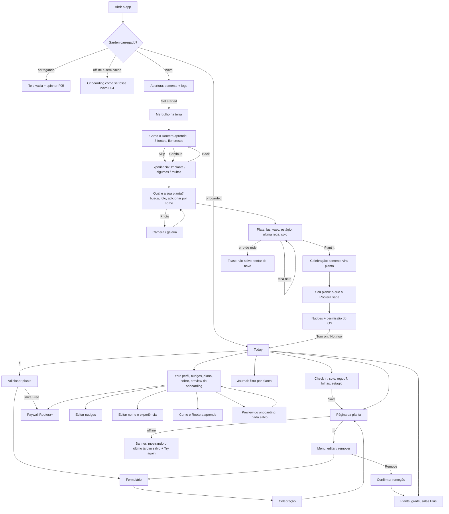

# Rootera: auditoria "pente fino" de UI/UX

Data: 25/09/2026. Versão auditada: commit `05beb47` + túnel de desenvolvimento (não commitado).
Método: navegação real (Chrome headless via Playwright) em 390 px e 1440 px, claro e escuro, com banco de teste isolado (API :8003, web :8083). Foram gerados 170+ screenshots, estados forçados (vazio, carregando, offline, erro 500, 500 plantas, nomes longos, zoom 200%, teclado, reduce motion/transparency) e medições (contraste WCAG calculado dos tokens, tempo de renderização, nós de DOM, peso de payload e assets). Skills: `redesign-existing-projects`, `ui-ux-pro-max` (UX guidelines + stack react-native + MASTER.md), `design-taste-frontend` (checklist anti-slop e pre-flight), `frontend-design`.

**Leitura de design:** produto mobile nativo (Expo/React Native) para iniciantes ansiosos e colecionadores, em linguagem Apple-adjacente ("Greenhouse Glass": vidro só no chrome flutuante) com ilustração botânica própria. A skill de gosto declara nativo fora de escopo para suas regras de layout de landing page; usei dela o detector de slop e o pre-flight, e para ergonomia mobile usei Apple HIG + ui-ux-pro-max.

Evidências: `docs/auditoria/NN-nome.jpg` (33 capturas selecionadas) e `arquivo:linha`.

---

## 1. Resumo executivo

### As 5 descobertas mais importantes

1. **O app não escala para quem mais cuida de plantas.** Com 500 plantas, a tela Today leva **18,4 s** para aparecer, trocar para Plants leva ~5,9 s e Journal ~4,7 s, com **27 mil nós** no DOM; o `/v1/garden` devolve **1,17 MB em 2,6 s**. Todas as listas usam `ScrollView` + `map` sem virtualização, e "Needs you" vira uma lista de 455 botões iguais. A persona Entusiasta abandona aqui (F01 a F03).
2. **Acessibilidade tem boas bases, mas quatro furos reais:** status de solo/folhas diferenciado **só por cor** (âmbar vs. terracota, mesmo formato), botões "Check in" **sem o nome da planta** para leitor de tela, layout **quebra em zoom 200% / Dynamic Type grande** (callouts em posição absoluta, tab bar estoura) e **VoiceOver não anuncia** salvamentos e erros (`accessibilityLiveRegion` só funciona no Android) (F06 a F09).
3. **Os primeiros segundos são os mais frágeis.** Carregamento é tela vazia com spinner centralizado; e se o celular estiver sem conexão na primeira abertura, o app **manda a pessoa para o onboarding** como se fosse nova, e só falha no fim, ao tocar "Plant it" (F04, F05).
4. **Pequenas inconsistências que corroem confiança:** o ajuste de Nudges diz que notificações no celular "são o próximo passo", mas o onboarding já pediu a permissão do iOS; o mesmo ajuste ("como o Rootera explica") é um switch em um lugar e um segmented em outro; os rótulos de experiência mudam entre telas; o rodapé de You mostra `127.0.0.1:8003`; o paywall lista "a mesma orientação honesta" como benefício do Plus (F12 a F16).
5. **Dados que a pessoa informa somem.** O estágio da planta e a última rega aproximada, perguntados no onboarding, não aparecem na página da planta; e logo depois de regar, o callout de solo mostra "Dry" em âmbar como manchete, uma leitura já vencida (F10, F11).

### Notas por dimensão (0 a 10)

| Dimensão | Nota | Por quê, em uma linha |
|---|---|---|
| Usabilidade | **7,0** | Fluxos centrais curtos (check-in em 4 toques), bom onboarding progressivo; perde em escala, estados de primeira abertura e menu sem saída clara. |
| Acessibilidade | **6,0** | Contraste de texto excelente (ink 14,7:1), foco visível, reduce motion/transparency reais; falha em cor como único sinal, nomes acessíveis, reflow e anúncios no iOS. |
| Visual | **8,0** | Identidade clara (ilustração + Bricolage + vidro contido), hierarquia boa; halos no escuro, nomes longos gigantes e deriva do MASTER.md. |
| Motion | **7,0** | Momentos de marca fortes (semente, mergulho, flor); falta continuidade entre telas, feedback de salvar e o reveal de texto repetido cansa. |
| Conteúdo | **7,5** | Tom honesto e específico, zero clichê de IA; algumas frases vagas ("Keep an eye on the change") e contradições de copy. |
| Performance | **5,0** | Ótimo com 1 a 10 plantas; colapsa com centenas; payload monolítico; 1,6 MB de assets mortos; spinner em vez de skeleton. |
| Originalidade / anti-slop | **8,5** | Nenhum tell de IA: sem gradiente roxo, sem 3 cards iguais, sem emoji, vidro com intenção, ilustração própria. Ressalva: ícones feitos à mão (documentado). |

### Pre-flight anti-slop (design-taste-frontend), aplicado ao app

| Item | Resultado |
|---|---|
| Em-dash / middle-dot em texto visível | OK (nenhum; regra já documentada no MASTER) |
| Paleta genérica (roxo/azul, bege+latão) | OK (oliva + folha, terracota e água semânticos) |
| 3 cards iguais / hero centralizado genérico | OK (Today é lista editorial; experiência é bento 2+1) |
| Vidro em tudo | OK (só tab bar, headers, toasts, callouts) |
| Raio consistente | OK (escala documentada 4/6/10/16/26) |
| Contraste de botões | OK nos ativos (10,7:1); botão desabilitado 2,2:1 sem motivo explicado (F19) |
| Emoji como ícone | OK (nenhum) |
| Ícones de biblioteca | **Desvio documentado:** 30 glifos SVG próprios. Coerentes (grid 24, traço 1,75), mas manutenção e cobertura ficam com vocês. |
| Estados vazio/carregando/erro | Parcial (F04, F05, F22) |
| Reduced motion | OK (toda animação tem caminho reduzido) |

---

## 2. Mapa de fluxos



Métricas dos fluxos principais (medidas na automação; tempo humano estimado com leitura):

| Fluxo | Telas | Toques | Tempo (auto / humano) | Onde trava |
|---|---|---|---|---|
| Onboarding completo | 7 + 2 momentos | 16 | 36 s / ~90 a 120 s | 5 notas seguidas no plate; títulos com reveal palavra por palavra em todo passo |
| Check-in diário | 2 | 4 | 3 s / ~10 s | CTA cinza desabilitado até responder; nada muda na lista além de um toast |
| Adicionar 2ª planta | 3 + celebração | 5 a 7 | / ~40 s | celebração de ~4 s sem pular |
| Mudar horário dos nudges | 3 | 4 | / ~15 s | ajuste de detalhe duplicado em You |
| Achar 1 planta entre 500 | 1 | rolagem longa | / minutos | sem busca em Plants, 500 chips no Journal |

---

## 3. Achados

Severidade: **Crítica** bloqueia uma persona; **Alta** prejuízo claro para muitos; **Média** atrito real; **Baixa** polimento. Esforço: P (horas), M (1 a 3 dias), G (semana+).

| ID | Tela/Fluxo | Problema | Evidência | Princípio violado | Sev. | Solução proposta | Esf. |
|---|---|---|---|---|---|---|---|
| F01 | Today, Plants, Journal | Listas sem virtualização; com 500 plantas: 18,4 s até Today, 5,9 s Plants, 4,7 s Journal, 27k nós; `garden.plants.find` dentro de `map` (O(n²)) | `src/screens/Main.tsx:95,118,180,235`; `29-500-today.jpg` | Doherty (<400 ms); guideline RN "FlatList para 50+ itens" (ui-ux-pro-max) | **Crítica** | `FlatList` (ou FlashList) + linhas `React.memo` + `Map` id→planta; seções com `SectionList` | M |
| F02 | API `/v1/garden` | Snapshot monolítico: 1,17 MB / 2,6 s com 504 plantas; todos os eventos e twins em uma resposta | medição `curl` | Performance percebida; payload proporcional à tela | Alta | Resumo leve no garden (último estado + guidance) e eventos paginados por planta/dia | M |
| F03 | Today, "Needs you" | 455 linhas idênticas com o mesmo CTA; sem agrupamento, ordenação visível ou busca | `29-500-today.jpg` | Hick, Miller, estética minimalista | Alta | Mostrar 5 mais urgentes + "Ver todas (455)"; agrupar por sala; fluxo "Rodada" (ideia I2) | M |
| F04 | Primeira abertura offline | Sem cache + API fora = app assume não-onboarded e abre o onboarding; falha só em "Plant it" | `26-offline-primeira-abertura.jpg`; `App.tsx:51-56` | Visibilidade do status; prevenção de erros | Alta | Estado "Não conseguimos falar com o Rootera" com Tentar de novo; nunca decidir onboarded sem resposta do servidor | P |
| F05 | Carregamento | Tela vazia com `ActivityIndicator` centralizado até o garden chegar | `21-loading-spinner.jpg`; `App.tsx:52` | Performance percebida; skeleton > spinner | Alta | Skeleton com a forma da Today (demo 3) ou manter splash até pronto | P |
| F06 | Página da planta, Plants | Status "envelhecendo" (âmbar) e "atrasado" (terracota) diferem só por cor; mesmo círculo cheio | `src/screens/Plant.tsx:25-29` | WCAG 1.4.1 (uso de cor) | Alta | Formas distintas: cheio / meio-cheio / anel com traço; manter texto no rótulo acessível | P |
| F07 | Today | Botões "Check in" (≥370 px) têm nome acessível só "Check in"; 3+ iguais em sequência para VoiceOver | `Main.tsx:108`; ordem de tab registrada | WCAG 2.4.6 / 4.1.2 | Alta | `accessibilityLabel={\`Check in, ${p.name}\`}` | P |
| F08 | Página da planta, onboarding, tab bar | Callouts e nós em posição absoluta com largura fixa (122/116 px); em zoom 200% a tab bar ocupa a tela e You estoura na horizontal; Dynamic Type vai até 1,7× sem layout alternativo | `23-zoom200.jpg`, `24-zoom200-overflow.jpg`; `onboarding/FirstPlant.tsx:41`, `onboarding/Story.tsx:121` | WCAG 1.4.10 (reflow), 1.4.4 | Alta | Acima de 1,3× de fonte: specimen vira lista, tab bar só ícones com rótulo acessível; testar tamanhos AX | M |
| F09 | Toasts, história | `accessibilityLiveRegion` é só Android; no iOS salvamentos e erros não são anunciados | `src/ds/components.tsx:208`; `onboarding/Story.tsx:143` | WCAG 4.1.3 (mensagens de status) | Alta | `AccessibilityInfo.announceForAccessibility` no iOS dentro do `Toast` | P |
| F10 | Página da planta | Estágio (Seedling/Young/Mature) e última rega aproximada do onboarding não aparecem em lugar nenhum da planta | `12-detalhe-planta.jpg` | Reconhecer em vez de lembrar; confiança | Média | Callout ou linha "Estágio"; figura "Regada ~3 dias atrás (aprox.)" | P |
| F11 | Página da planta após check-in | Depois de "Dry + regou agora", o callout de solo mostra "Dry" em âmbar como estado atual | `15-checkin-salvo-solo-seco.jpg` | Correspondência com o mundo real | Média | Após rega, solo mostra "Regada agora, checar em ~N dias"; leitura seca vai para o histórico | P |
| F12 | You › Nudges | Texto diz "Phone notifications are the next step for this preview", mas o onboarding já pediu permissão do iOS | `src/screens/Profile.tsx:67`; `16-nudges-edit-contradicao.jpg` | Consistência; honestidade | Alta | Mostrar status real da permissão (ligada / negada + "Abrir Ajustes"); ajustar copy | P |
| F13 | You vs. Nudges | O mesmo ajuste ("como o Rootera explica") aparece como segmented em You e como switch em Nudges/onboarding | `11-you-host-dev.jpg`, `08-nudges.jpg` | Consistência (Jakob) | Média | Um controle (switch), um lugar (Nudges); You mostra só o resumo | P |
| F14 | Perfil | Rótulos de experiência mudam: "My first plant / Lots of plants, or a whole garden" vs. "First plant / Many plants or a garden"; dicas também | `Profile.tsx:12`, `model.ts:59`; `17-perfil-rotulos.jpg` | Consistência | Baixa | Uma fonte única de rótulos e dicas | P |
| F15 | You | Rodapé expõe `127.0.0.1:8003` (host de dev) | `Main.tsx:273`; `11-you-host-dev.jpg` | Correspondência com o mundo real | Média | "Seu jardim fica salvo no servidor da prévia do Rootera" | P |
| F16 | Paywall | "The same honest guidance" listado como benefício; economia anual (−42%) não aparece; preços em R$ com interface en-US | `src/screens/Plans.tsx:24`; `28-paywall.jpg` | Clareza de valor; ancoragem | Média | Trocar por benefício real (salas, fotos, histórico ilimitado); "Economize 42%"; moeda pela loja | P |
| F17 | Menu da planta | Popover sem scrim, sem Esc, foco não vai para o menu, cobre callouts | `Plant.tsx:238`; `13-menu-sem-scrim.jpg` | WCAG 2.4.3; controle e liberdade | Média | `ActionSheetIOS`/bottom sheet nativa ou scrim + foco + Esc | P |
| F18 | Ordem de foco | Botão "+" do topo é o último na ordem de tab; header vem depois do conteúdo | log de tab (seção 4) | WCAG 2.4.3 | Média | Renderizar ações do header antes do conteúdo | P |
| F19 | Experiência, Check in, Nome | CTAs desabilitados cinza (2,2:1) sem dizer o que falta; no passo da planta o CTA só aparece quando pode | `04-experiencia-cta-desabilitado.jpg`, `14-checkin.jpg` | Consistência; prevenção de erro | Média | Um padrão: CTA visível + dica "Escolha como o solo está" | P |
| F20 | Today pós-onboarding | Convite de nome (~170 px) aparece acima de "Needs you" no primeiro contato | `09-today-1-planta.jpg`; `Main.tsx:81` | Pico-fim; foco no valor | Média | Mostrar depois do 1º check-in, em uma linha | P |
| F21 | Nomes longos | Título display 40 pt quebra em 5 a 6 linhas (320 px) e empurra tudo | `20-nome-longo.jpg`, `27-320px-detalhe.jpg` | Estética-usabilidade | Média | Máx. 3 linhas + degrau de tamanho (40→30→24) | P |
| F22 | Plants vazio | Só um tile tracejado "Add a plant", sem explicação (Today vazio é bom) | `32-plants-vazio.jpg` | Estados vazios que ensinam | Média | Reusar a composição do Today vazio | P |
| F23 | Salas | Chips em ordem de inserção ("Room 10" antes de "Room 2") | `30-500-plants.jpg`; `Main.tsx:166` | Reconhecimento | Baixa | Ordenação natural + contagem por sala | P |
| F24 | Tema escuro | Sombra creme "assada" na arte do vaso/gérbera vira halo claro | `18-dark-halo-vaso.jpg` | Estética; consistência de luz | Média | Reexportar arte sem sombra e desenhar o `Ground` em código | P |
| F25 | Web desktop | Coluna de celular de 440 px no meio de uma tela vazia | `19-desktop-coluna.jpg` | Jakob (web) | Baixa | Moldura de device na prévia web; layout de 2 colunas só se houver tablet | M |
| F26 | Onboarding | Todo título revela palavra por palavra (~1 s+) em todo passo | `Onboarding.tsx:207` | Doherty; motion com propósito | Média | Reveal só no 1º título da história; demais: fade 160 ms | P |
| F27 | História | "You observe" quebra em 2 linhas (nó de 116 px) e os outros não | `02-historia-espera.jpg` | Alinhamento | Baixa | Largura pelo conteúdo | P |
| F28 | Escolha da planta | Carrossel mostra exatamente 4 tiles, sem "espiar" o 5º; parece que só há 4 | `05-escolha-planta.jpg` | Descoberta (affordance) | Média | 4,5 tiles visíveis ou grade de 2 linhas | P |
| F29 | Progresso | Semente que enche é bonita mas não diz "passo 2 de 4" visualmente | cabeçalho do onboarding | Gradiente de objetivo | Baixa | Semente segmentada em 4 ou contador discreto | P |
| F30 | Callouts de vidro | ink3 sobre vidro 0,72 pode cair para 3,6:1 sobre folhagem escura | tabela de contraste (seção 4) | WCAG 1.4.3 | Baixa | Mínimo ink2 em callouts ou tint 0,8 | P |
| F31 | Assets | `assets/plants-riso` (1,6 MB) não é usado; ilustrações em PNG (~2,7 MB) | `du` | Performance | Baixa | Apagar riso; converter para WebP | P |
| F32 | Háptica | Nenhuma háptica no app (`expo-haptics` ausente) | `package.json` | Feedback (Apple HIG) | Média | Háptica leve em seleção, forte em salvar/celebrar | P |
| F33 | Check-in | Não dá para desfazer nem editar um registro salvo | fluxo | Controle e liberdade | Média | Toast com "Desfazer" por 5 s (demo 2) + editar no Journal | M |
| F34 | Celebração | ~4 s de animação obrigatória antes do plano; toque não pula | `ob-celebrate` | Controle; Doherty | Baixa | Tocar para pular | P |
| F35 | Plano | Última linha fica sob o rodapé fixo sem fade | `07-plano.jpg` | Visibilidade | Baixa | Fade de borda / padding extra | P |
| F36 | Today < 370 px | Check-in vira só ícone de "solo", ambíguo | `27-320px-detalhe.jpg` | Reconhecer em vez de lembrar | Baixa | Texto curto "Check" ou ícone + texto | P |
| F37 | Guidance | Frases vagas: "Keep an eye on the change", "Time for a fresh check" | `09-today-1-planta.jpg` | Clareza de conteúdo | Baixa | Verbo + objeto: "Olhe a folha que mudou", "Cheque o solo hoje" | P |
| F38 | Design system | MASTER.md descreve Instrument Serif e display 46/hero 36; código usa Bricolage 40/30 | `design-system/rootera/MASTER.md:49-58` | Fidelidade ao DS | Média | Atualizar MASTER (tipo, callout glass, tokens de motion) | P |
| F39 | Idioma | Interface 100% en-US, público e preços brasileiros | geral | Correspondência com o mundo real | Média | Decidir: en para o Shipaton + pt-BR em seguida (i18n) | M |

**O que está bom e deve ser preservado:** o banner offline ("Showing your last saved garden… Try again") é exemplar; foco visível só para teclado; reduce motion e reduce transparency de verdade (tab bar vira sólida); contraste de texto alto nos dois temas; tom honesto (nunca inventa porcentagem); check-in em 4 toques; paywall só depois do valor; onboarding com Skip, Back e "Not sure" em toda pergunta.

---

## 4. Jornada das 3 personas

### Iniciante (ansiosa, pouca paciência, uma planta)

| Momento | Pensa / sente | Atrito ou satisfação |
|---|---|---|
| Abertura (5 s) | "Que bonitinho." | Satisfação. Mas sem conexão ou com rede lenta vê tela vazia com spinner (F05). |
| Mergulho + história | "Não entendi o que é 'You tell us'… ah, agora sim." | O texto só aparece depois do toque (bom); cada título demora ~1 s para se revelar (F26). |
| Experiência | "My first plant." | CTA cinza sem explicação até escolher (F19). |
| Escolha da planta | "A minha não está aqui… tem mais?" | Não percebe que o carrossel rola (F28). A busca e "Add by name" salvam. |
| Plate | "5 perguntas? não sei o vaso." | "Not sure" sempre disponível acalma. Satisfação ao ver as notas em volta da planta. |
| Plano | "Ah, então é isso que ele faz." | Pico positivo. Última linha escondida (F35). |
| Today | "Por que ele quer meu nome agora?" | O convite de nome compete com a primeira ação (F20). |
| 1º check-in | "Salvou? mudou algo?" | Só um toast; sem háptica (F32); não dá para desfazer (F33). |

Resultado: completa, com 3 pontos de dúvida. Risco maior: primeira abertura sem internet (F04).

### Entusiasta (40+ plantas, quer eficiência)

| Momento | Pensa / sente | Atrito |
|---|---|---|
| Onboarding | "Rápido, cadê o pular?" | Skip só na história; o resto é obrigatório (ok), mas os reveals atrasam (F26). |
| Cadastrar 40 plantas | "Uma por uma? E cada uma com celebração?" | Sem cadastro em lote, celebração sem pular (F34). |
| Today com muitas | "Rolando, rolando…" | Lista enorme e igual (F03); com centenas o app congela (F01). |
| Achar a planta X | "Cadê a busca?" | Plants sem busca; Journal com um chip por planta (F03, F23). |
| Rotina | "Queria passar em todas de uma vez." | Não existe modo "rodada" (ideia I2). |

Resultado: desiste na escala. É a persona mais disposta a pagar (salas, ilimitado), então é o maior risco de receita.

### Acessibilidade (leitor de tela, teclado, baixa visão, daltonismo, uma mão)

| Situação | O que acontece |
|---|---|
| VoiceOver na Today | Ouve "Check in, botão" 3 vezes sem saber de qual planta (F07). Salvar não é anunciado (F09). |
| Só teclado (web) | Foco visível e bonito (`25-foco-teclado.jpg`); "+" é o último da ordem (F18); menu da planta não fecha com Esc (F17). |
| Baixa visão (200% / fonte grande) | Tab bar domina a tela, You estoura para os lados, callouts se sobrepõem (F08). |
| Daltonismo (deuteranopia) | Âmbar e terracota ficam quase iguais; "aging" e "overdue" indistinguíveis (F06). |
| Uma mão | Tab bar e CTAs principais na zona do polegar (bom); "+" e "…" no canto superior direito ficam fora do alcance; nenhum gesto alternativo. |
| Reduce motion / transparency | Respeitados em todo o app. Ponto forte. |

Ordem de tab medida na Today: Not now → Your name → Grandmother's… → Check in → Aloe… → Check in → Peace Lily… → Check in → Pothos… → Open the journal → eventos → **Add a plant** (último).

Contraste medido (WCAG, a partir dos tokens): ink/canvas 14,68 (claro) e 16,52 (escuro); ink3/canvas 5,57; onAction/action 10,68; leafText/successSoft 4,95; texto em vidro 0,86 sobre folhagem escura 4,66 (ink3). Abaixo de 4,5: ink3 em vidro 0,72 sobre folhagem (3,60), botão desabilitado (2,17, isento pela WCAG mas ilegível), marcas leafMark 3,20 e âmbar 3,86 (ok como não-texto, 3:1).

---

## 5. Ideias novas

| # | Problema que resolve | Proposta | Princípio de UX | Impacto esperado | Esf. |
|---|---|---|---|---|---|
| I1 | A página da planta não mostra que o Rootera está aprendendo | **Anel de padrão**: a figura "0/3 ciclos" vira um anel que fecha um arco por ciclo; no 3º, a planta ganha seu 1º "fato aprendido" (demo 5) | Gradiente de objetivo; Zeigarnik | Mais check-ins até o 3º ciclo, que é onde nasce a diferença do produto | P |
| I2 | Entusiastas com muitas plantas | **Rodada da manhã**: um fluxo em pilha de cartões que passa por todas as plantas que precisam de você; um toque por planta (seco/úmido/pular) | Hick; Tesler (complexidade no lugar certo) | Check-in de 20 plantas em ~1 min em vez de 20 idas e vindas | M |
| I3 | Iniciante não sabe "quão fundo" colocar o dedo | **Régua de profundidade**: ilustração do vaso da espécie com a linha "até aqui" (2 cm para lírio, fundo para suculenta), com háptica ao arrastar | Correspondência com o mundo real; ajuda contextual | Menos "Not sure", leituras mais consistentes | M |
| I4 | Salvar parece sem efeito | **A planta reage**: gotas caem e a planta "bebe" (squash e endireita), e a linha viaja de "Needs you" para "Resting" com Desfazer (demo 2) | Feedback imediato; continuidade | Confiança no registro; menos toques duplicados | P |
| I5 | A história do onboarding fica só no onboarding | **"Por que isto?"** em cada sugestão abre o mesmo diagrama das 3 fontes, com as fontes que valeram acesas | Consistência; reconhecer em vez de lembrar | Explicabilidade vira marca registrada, argumento forte na Shipaton | P |
| I6 | Pouca razão para voltar entre regas | **Diário de fotos**: 1 foto opcional por mês por planta, montada em uma tira de crescimento | Pico-fim; progresso visível | Retenção de longo prazo; conteúdo compartilhável | M |
| I7 | Estados vazios sem convite | **Vazios que ensinam**: Plants vazio mostra um "specimen fantasma" com as 3 notas que o Rootera vai aprender | Estados vazios acionáveis | Menos abandono antes da 1ª planta | P |
| I8 | Contexto do dia não aparece | **Luz do dia**: a tinta do canvas e a sombra do `Ground` acompanham a hora (manhã mais fria, fim de tarde mais quente), sutil e desligável | Estética-usabilidade; ambiente | Sensação de "vivo" sem ruído | P |
| I9 | Erro de registro não tem volta | **Linha do tempo editável**: no Journal, deslizar um registro para editar ou apagar, com Desfazer | Controle e liberdade | Menos medo de errar (Iniciante) | M |
| I10 | Nudge chega sem ação | **Nudge acionável**: a notificação já traz botões "Seco / Úmido" (actions do iOS), registrando sem abrir o app | Fitts; reduzir passos | Check-in em 1 toque na tela de bloqueio | M |
| I11 | Nada fora do app lembra a planta | **Widget iOS** "Próxima checagem": a planta mais urgente com seu estado | Visibilidade do status | Retenção diária sem notificação | G |
| I12 | Celebração é igual para tudo | **Marcos de estágio**: quando o estágio muda (Seedling → Young), a SeedDrop toca de novo com a arte do novo estágio (já previsto no SeedDrop) | Pico-fim; gamificação sutil sem dark pattern | Momento memorável e compartilhável; sem streaks punitivos | M |
| I13 | Busca com nome popular BR | **Busca tolerante**: sem acento e com sinônimos regionais ("espada-de-são-jorge", "costela-de-adão") e erros de digitação | Flexibilidade; mundo real | Menos "Add by name" genérico | P |
| I14 | Uma mão | **Ações por gesto na linha**: deslizar uma planta na Today para registrar "Checado: seco/úmido" | Fitts (zona do polegar) | Uso com uma mão; eficiência para Entusiasta | M |

Nenhuma ideia usa streak punitivo, contagem regressiva falsa ou culpa (sem dark patterns).

---

## 6. Plano de ação priorizado

### 🟢 Onda 1: quick wins (alto impacto, baixo esforço, ~2 a 3 dias)

1. Nome acessível nos "Check in" (F07) e anúncios de toast no iOS (F09).
2. Status com forma além de cor (F06).
3. Primeira abertura offline + skeleton no lugar do spinner (F04, F05).
4. Copy: Nudges vs. permissão real (F12), host de dev (F15), rótulos de experiência únicos (F14), frases vagas de guidance (F37), paywall (F16).
5. Um só controle para "como o Rootera explica" (F13); CTA desabilitado com dica (F19).
6. Menu da planta como sheet com scrim e Esc; ordem de foco do header (F17, F18).
7. Convite de nome depois do 1º check-in (F20); Plants vazio que ensina (F22); ordenação natural de salas (F23).
8. Reveal de título só no primeiro passo; tocar para pular a celebração (F26, F34).
9. Estágio e rega aproximada visíveis na planta; solo pós-rega correto (F10, F11).
10. Apagar `plants-riso`; atualizar MASTER.md (F31, F38).

### 🟡 Onda 2: melhorias estruturais (~1 a 2 semanas)

1. Virtualizar listas + `Map` de plantas + memo (F01); garden resumido + eventos paginados (F02).
2. "Needs you" com top 5 + ver todas, busca em Plants e seletor de planta no Journal (F03).
3. Layout alternativo para fonte grande / zoom (F08) e tab bar só com ícones nessa condição.
4. Desfazer e editar registros (F33, I9); háptica (F32).
5. Transição compartilhada tile → planta e reação ao salvar (demos 1 e 2).
6. Arte sem sombra assada para o tema escuro (F24); WebP (F31).
7. i18n pt-BR (F39).

### 🔵 Onda 3: apostas inovadoras

1. Rodada da manhã (I2) e gestos na linha (I14).
2. Anel de padrão + fato aprendido (I1) e marcos de estágio (I12).
3. Régua de profundidade com háptica (I3).
4. Nudge acionável na tela de bloqueio (I10) e widget (I11).
5. Diário de fotos (I6) e "Por que isto?" com o diagrama das fontes (I5).

---

## 7. Antes / depois das 3 telas mais críticas

### 7.1 Today (Entusiasta, e o primeiro contato do Iniciante)

Antes (`09-today-1-planta.jpg`, `29-500-today.jpg`):
```
Friday, September 25
Good evening
┌ What should we call you?  [x] ┐   <- compete com a 1ª ação
│ [__________] [Save name]       │
└────────────────────────────────┘
Needs you  455 plants
[img] Aloe #19     dry      [Check in]
[img] Aloe #211    dry      [Check in]   <- 455 linhas iguais,
[img] Aloe #403    dry      [Check in]      "Check in" sem nome p/ VoiceOver
... (18 s para aparecer)
```
Depois:
```
Friday, September 25
Good evening
┌─────────────────────────────────────────┐
│  Morning round: 12 plants, about 2 min  │  <- Rodada (I2), 1 CTA
│  [Start the round]                      │
└─────────────────────────────────────────┘
Needs you  12                       [Kitchen v]
[img] Monstera   soil was dry 2 d ago   [Check in]  <- label "Check in, Monstera"
[img] Aloe       time for a check       [Check in]
[img] Peace Lily lower leaf changed     [Look]
See all 12 >
Resting  43                                 (virtualizada)
```
Nome: convite de uma linha só depois do 1º check-in.

### 7.2 Página da planta

Antes (`12-detalhe-planta.jpg`, `15-checkin-salvo-solo-seco.jpg`, `20-nome-longo.jpg`): título de 5 linhas, "Soil: Dry" âmbar logo após regar, estágio ausente, cor como único status, menu sem scrim.

Depois:
```
[<]                                  [...] -> sheet nativa
 (●) Light          ┌─────────┐   Leaves (○)
 Bright, indirect   │  planta  │   not noted yet
 (◐) Stage          │ (squash  │   Soil (◔)
 Young              │ ao regar)│   watered just now
                    └─────────┘
Grandmother's enormous variegated          <- máx 3 linhas, 30 pt
Monstera from the kitchen…
Monstera deliciosa   Kitchen
 8 days        20 h           ◔◔○  1/3 cycles   <- anel de padrão (I1)
since watering since check
Rootera suggests: check again in about 5 days   [Why?] (I5)
[Check in]
```
Marcas de status: ● em dia, ◐ envelhecendo, ◔ com traço = atrasado, ○ sem registro.

### 7.3 Primeira abertura (carregando / offline)

Antes: `21-loading-spinner.jpg` (spinner no vazio) e `26-offline-primeira-abertura.jpg` (onboarding falso).
Depois:
```
Carregando (garden em cache ausente):     Offline sem cache:
Friday, September 25                      [vaso vazio ilustrado]
Good morning                              Can't reach Rootera
Needs you                                 Your garden lives on the server.
[▒▒] ▒▒▒▒▒▒▒▒      [▒▒▒▒]                 Check your connection.
[▒▒] ▒▒▒▒▒▒▒▒▒▒    [▒▒▒▒]                 [Try again]
(skeleton da forma real, demo 3)          (nunca abre o onboarding sem saber)
```

---

## 8. Plano de motion

### 8.1 Auditoria do motion atual

| Animação | Onde | Veredito |
|---|---|---|
| SeedDrop (semente cai, broto, planta) | abertura, nova planta, celebração | **Funciona**: é a assinatura do produto. Agora em crossfade de frames, sem escala 0. |
| LogoSprout (caule empurra o O) | abertura | **Funciona** como momento de marca; confirmar no iPhone que o piscar sumiu. |
| Mergulho na terra + raízes + SoilReveal | abertura → história | **Funciona**: continuidade espacial real entre telas. |
| Flor que cresce por toque + linhas | história | **Funciona**: motion conta a história. |
| Plate: planta cresce da silhueta, notas com linha | 1ª planta | **Funciona**; manter 2 focos no máximo. |
| TextReveal (blur palavra por palavra) | todo título do onboarding | **Genérico quando repetido**: bonito uma vez, lento em todo passo (F26). |
| Stagger (fade-up) em toda linha de lista | Today, Plants, Journal | **Genérico**: "fade-in em tudo"; com muitas linhas vira custo. |
| Tap press spring | todos os botões | **Funciona** (feedback tátil visual). |
| WaterDrops / LeafBurst | planta, paywall | **Subusado**: não dispara no check-in, que é o momento mais frequente. |
| Glow pulsante | nós da história | **Funciona**, com saída limpa. |
| Atmosphere (manchas que derivam) | experiência | **Decorativo**; aceitável por ser só no onboarding. |
| DetailSwitch + ícone de mensagem | nudges | **Funciona**. |
| Carregamento | app inteiro | **Falta**: spinner genérico (F05). |
| Transição entre telas | stack | **Falta**: slide padrão; nenhuma continuidade tile → planta. |
| Erro | toasts | **Falta**: sem shake, sem háptica. |
| Desfazer / UI otimista | check-in | **Falta**. |

### 8.2 Animações propostas (16)

| # | Onde | Gatilho | O que acontece | Propósito | Duração e curva | Tecnologia | Esf. | Prior. |
|---|---|---|---|---|---|---|---|---|
| M1 | Plants → Planta | toque no tile | a ilustração voa do tile para o topo; o cartão vira a página (**demo 1**) | continuidade espacial | spring smooth 190/26 (~380 ms); volta 300 ms ease-in | Reanimated `sharedTransitionTag` (ou FLIP manual com `measure`) | M | Alta |
| M2 | Check in → salvar | Save | gotas caem, a planta "bebe" (squash) e a linha migra de seção, com toast Desfazer (**demo 2**) | feedback + onde foi parar + controle | gotas 520 ms ease-in; squash 700 ms; linha spring smooth; toast 5 s | Reanimated + `LinearTransition` + expo-haptics | M | Alta |
| M3 | Primeira carga, refresh | fetch | skeleton com a forma da tela; brilho varre; conteúdo entra em 240 ms, stagger 40 ms, máx 3 (**demo 3**) | reduzir espera percebida, CLS 0 | varredura 1,6 s; entrada 240 ms ease-out | Reanimated + `LinearGradient` | P | Alta |
| M4 | Tab bar | toque / rolagem | a placa desliza até a aba; o vidro cede sob o dedo; o blur aprofunda com o scroll (**demo 4**) | materialidade do Liquid Glass | placa spring snappy 340/22; squash 90 ms + bouncy; blur ligado ao scroll | Reanimated `useAnimatedScrollHandler` + expo-blur `intensity` animada | M | Média |
| M5 | Figura "ciclos" | ciclo completo | arco fecha, número conta, no 3/3 folhas estouram e surge o fato aprendido (**demo 5**) | gradiente de objetivo; pico | arco 520 ms; contagem 400 ms; burst 700 ms bouncy | Reanimated + react-native-svg | P | Alta |
| M6 | Opções de solo | seleção | amostra de solo "afunda" 2 px e volta; háptica leve | feedback | spring snappy; 120 ms | Reanimated + expo-haptics `selectionAsync` | P | Alta |
| M7 | Toast de erro | falha ao salvar | shake horizontal 3 ciclos ±6 px + háptica de erro | feedback de estado | 300 ms total | Reanimated `withSequence` | P | Média |
| M8 | Títulos do onboarding | troca de passo | só o 1º título usa blur-in; demais: fade 160 ms | ritmo sem cansar | 160 ms ease-out | já existente (reduzir uso) | P | Alta |
| M9 | Header da página | scroll | título grande encolhe para a cápsula do topo (já existe) + blur aumenta | orientação | ligado ao scroll | Reanimated | P | Baixa |
| M10 | "Needs you" → "Resting" | guidance muda | linha reordena com layout animation | mostrar relação causa/efeito | spring smooth | Reanimated `LinearTransition` | P | Média |
| M11 | Celebração | qualquer toque | pula para o fim com crossfade | controle | 160 ms | estado + Reanimated | P | Média |
| M12 | Marco de estágio | estágio muda | SeedDrop com a arte do novo estágio (I12) | pico memorável | ~2,5 s, tocar para pular | SeedDrop existente | M | Média |
| M13 | Today (ambiente) | tela aberta > 3 s | a planta mais urgente "respira" (escala 1 → 1,01, 4 s, loop) | chamar atenção sem ruído | gentle 30/80; para no scroll e em reduce motion | Reanimated `withRepeat` | P | Baixa |
| M14 | Luz do dia (I8) | hora local | tinta do canvas e sombra mudam devagar | ambiente | transição de 2 s ao abrir | tokens por faixa de hora | P | Baixa |
| M15 | Estados vazios | tela vazia | folha da ilustração balança uma vez ao entrar | convite | 1,2 s gentle, uma vez | Reanimated | P | Baixa |
| M16 | Pull to refresh | puxar lista | uma gota se forma e cai no vaso; ao soltar, "rega" e atualiza | metáfora + estado | segue o dedo; soltar 400 ms | gesture-handler + Reanimated | M | Baixa |

### 8.3 Sistema de motion (tokens)

| Token | Valor | Uso |
|---|---|---|
| `dur.instant` | 90 ms | squash de toque, troca de cor |
| `dur.fast` | 160 ms | saídas, fades de texto, reduce motion |
| `dur.base` | 240 ms | entradas de conteúdo, toasts |
| `dur.slow` | 380 ms | transições de tela, shared element |
| `dur.story` | 700 a 1300 ms | só momentos de marca (semente, mergulho), sempre puláveis |
| `ease.out` | cubic-bezier(.2,.8,.2,1) | entradas |
| `ease.in` | cubic-bezier(.4,0,1,1) | saídas (mais rápidas que entradas) |
| `spring.snappy` | stiffness 340, damping 22 | toque, seleção, toggles, placa da tab bar |
| `spring.smooth` | 190 / 26 | layout, sheets, shared element |
| `spring.bouncy` | 170 / 11 | celebração, a planta se ajeitando |
| `spring.gentle` | 80 / 30, massa 1,2 | ambiente |
| `dist.nudge / step / enter / sheet` | 2 / 6 / 12 / 100% px | toque / stagger / entrada / sheet |
| `stagger` | 40 ms, máx 3 itens animados | listas (o resto aparece junto) |

Regras: animar só `transform`/`opacity` (e `blur` do vidro com moderação); nenhuma animação bloqueia input; mesma ação, mesma animação; toda animação tem versão reduzida (estado final ou crossfade ≤120 ms); no máximo 2 focos animados por tela; loops só ambientes e param no scroll.

**Biblioteca:** manter **Reanimated 4** (já no projeto, roda na UI thread, tem springs, layout animations e shared transitions), mais **expo-haptics** (funciona no Expo Go) e **react-native-svg** para arcos e linhas. **Lottie** (`lottie-react-native`, compatível com Expo Go) só se surgirem ilustrações ambientes feitas em After Effects. **Descartados:** GSAP e Motion/Framer (feitos para DOM, não para views nativas); **Rive** exige dev build, fora do Expo Go agora. As demos usam Web Animations + `linear()` com a **mesma física de spring** do Reanimated, então o que você aprova é o que será implementado.

### 8.4 Protótipo

[`docs/motion-demo.html`](motion-demo.html): abra no navegador (Chrome/Safari). As 5 demos (M1, M2, M3, M4, M5) funcionam com as ilustrações reais, nos temas claro e escuro, com um botão "Reduce motion" e respeitando `prefers-reduced-motion`.

---

## Anexo: método e reprodução

- Scripts de captura: `audit.js` (passes `onboard`, `after`, `modes`, `states`, `states2`, `big`, `empty`), `seed.py` (dados: `some`, `big`, `archive`), `contrast.py` (WCAG pelos tokens), no scratchpad da sessão.
- Limitações: a captura roda na versão web (react-native-web). VoiceOver, Dynamic Type real e desempenho de blur nativo precisam de confirmação no iPhone 12; tempos com 500 plantas foram medidos em build de desenvolvimento num desktop, então servem como ordem de grandeza.
- Zero erros de console em todos os modos e estados capturados.
